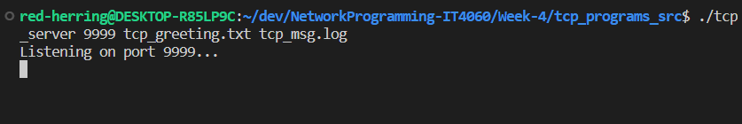
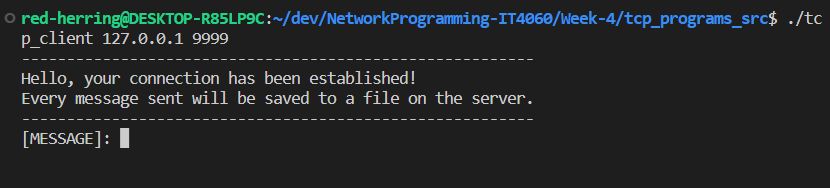
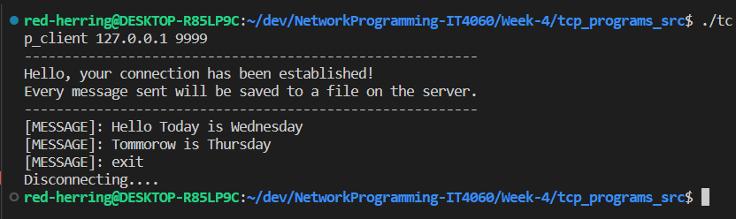
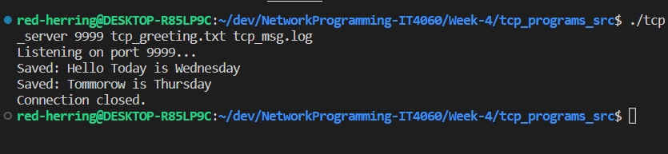
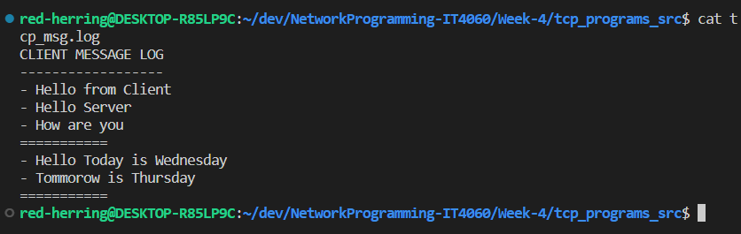
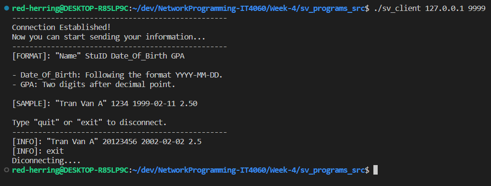
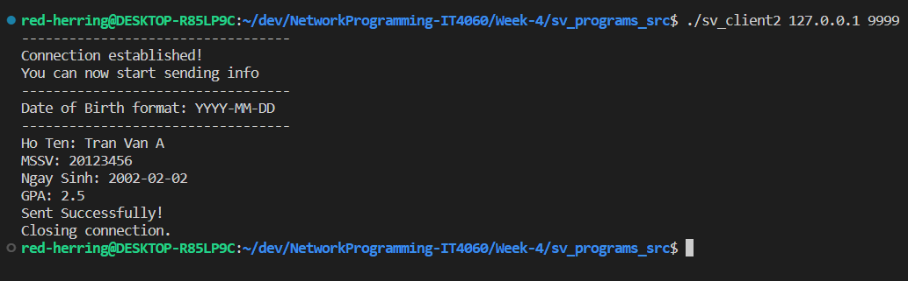
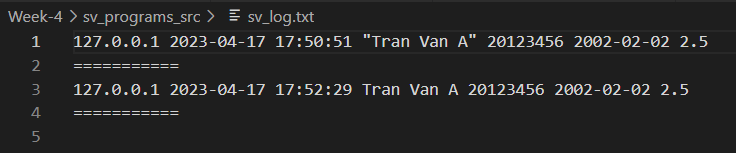

# Week 4

*Directory chứa bài tập về nhà trong tuần 4, có tổng cộng 4 bài tập, các bài đôi một đi kèm với nhau vì mỗi bài yêu cầu lập trình riêng biệt server hoặc client.*

## Đề Bài

*Đề bài nằm ở các **slide 136 và 137** trong [file PDF bài giảng](../Week-1/Lap_trinh_mang_IT4060.pdf) trong directory Week-1.*

### Bài 1

Viết chương trình tcp_client, kết nối đến một máy chủ xác định bởi địa chỉ IP và cổng. Sau đó nhận dữ liệu từ bàn phím và gửi đến server. Tham số được
truyền vào từ dòng lệnh có dạng:

```
tcp_client địa_chỉ_IP cổng
```

### Bài 2

Viết chương trình tcp_server, đợi kết nối ở cổng xác định bởi tham số dòng lệnh. Mỗi khi có client kết nối đến, thì gửi xâu chào được chỉ ra trong một tệp tin xác định, sau đó ghi toàn bộ nội dung client gửi đến vào một tệp tin khác được chỉ ra trong tham số dòng lệnh:

```
tcp_server cổng file_chứa_câu_chào file_chứa_nội_dung_client_gửi
```

### Bài 3

Viết chương trình sv_client, cho phép người dùng nhập dữ liệu là thông tin của sinh viên bao gồm **MSSV, Họ tên, ngày sinh, và điểm trung bình các môn học**. Các thông tin trên được đóng gói và gửi sang sv_server. Yêu cầu số byte cần gửi là nhỏ nhất có thể. Địa chỉ server được nhập từ tham số dòng lệnh.

### Bài 4

Viết chương trình sv_server, nhận dữ liệu từ sv_client, in ra màn hình và đồng thời ghi vào file sv_log. Ngoài dữ liệu được gửi từ client cần phải lưu
lại địa chỉ và thời gian client đã gửi. Tham số cổng và tên file log được nhập từ tham số dòng lệnh.

## Giải Thích Kết Quả

Directory bao gồm 2 thư mục *tcp_programs_src* và *sv_programs_src* lần lượt lưu mã nguồn của bài tập 1 - 2 và bài tập 3 - 4. Các file mã nguồn có thể được biên dịch và chạy thành công.

### TCP_CLIENT và TCP_SERVER

Thư mục *tcp_programs* chứa hai file client và server. Sau khi khởi động, server sẽ lắng nghe ở cổng được nhập tham số từ dòng lệnh, khi client kết nối tới sẽ gửi một file lời chào (được chỉ định ở tham số dòng lệnh) và bắt đầu nhận dữ liệu bên client rồi ghi vào một file log (được chỉ định ở tham số dòng lệnh).

Cả hai chương trình đều có chức năng xử lý tham số cổng kết nối, địa chỉ của server để xem liệu các tham số có hợp lệ, nếu không hợp lệ thì chương trình sẽ bị hủy và đưa ra tin nhắn báo lỗi cho người dùng.

<figure>
  
  <figcaption>Server đang đợi kết nối ở cổng 9999.</figcaption>
</figure>

<figure>
  
  <figcaption>Client đã kết nối thành công vào địa chỉ server tại cổng 9999 và đang đợi nhập liệu từ người dùng.</figcaption>
</figure>

<figure>
  
  <figcaption>User đã nhập liệu xong và yêu cầu hủy kết nối.</figcaption>
</figure>

<figure>
  
  <figcaption>Kết quả bên server.</figcaption>
</figure>

<figure>
  
  <figcaption>Kết quả ghi trong file <i>tcp_msg.log</i>. Có thể thấy dữ liệu mới được ghi vào sau khi nhận từ Client.</figcaption>
</figure>


### SV_CLIENT và SV_SERVER

Trong thư mục *sv_client* có hai phiên bản client khác nhau: sv_client.c và sv_client2.c. Hai client này khác nhau ở khâu nhập liệu, xử lý và đóng gói dữ liệu trước khi gửi qua bên server.

* **sv_client.c**: Sau khi kết nối với server thành công sẽ thực hiện in chỉ dẫn từ file *sv_instruction.txt* ra ngoài màn hình. Tiếp theo thực hiện lấy dữ liệu của người dùng BẮT BUỘC phải theo đúng cấu trúc chỉ định nếu không chuỗi kí tự nhập vào sẽ không được chấp thuận để đóng gói gửi qua server.

<figure>
  
  <figcaption>Minh họa sv_client.</figcaption>
</figure>

* **sv_client2.c**: Sau khi kết nối với client, server sẽ thực hiện in chỉ dẫn từ file *sv_instruction2.txt* ra ngoài màn hình. Người dùng sẽ nhập lần lượt các thông tin theo hướng dẫn trên màn hình, dữ liệu sẽ dược xử lý ngay sau khi nhập và người dùng BẮT BUỘC nhập đúng cấu trúc theo hướng dẫn trước khi nhập thông tin tiếp theo để đóng gói và gửi qua server.

<figure>
  
  <figcaption>Minh họa sv_client2.</figcaption>
</figure>

Hai xâu kí tự được đóng gói để chuyển tới server.

<figure>
  
  <figcaption>Kết quả so sánh 2 xâu kí tự trong file log</figcaption>
</figure>