# Week 5

*Directory chứa mã nguồn của các bài tập lập trình socket bố sung trong tuần 5, tổng cộng có 4 bài tập, được chia riêng thành 4 thư mục nhỏ hơn.*

## Đề Bài

### Bài tập 01.01 – Đóng gói dữ liệu

* Ứng dụng info_client cho phép người dùng nhập tên máy tính (là chuỗi ký tự), danh sách các ổ đĩa (gồm ký tự và kích thước ổ đĩa) từ bàn phím. Các dữ liệu này sau đó được đóng gói và chuyển sang info_server.
* Ứng dụng info_server nhận dữ liệu từ info_client, tách các dữ liệu và in ra màn hình. Ví dụ:
    + Tên máy tính MY_LAPTOP_DELL
    + Số ổ đĩa 3 
        * C–500GB 
        * D–250GB
        * E–250GB

### Bài tập 01.02 – Xử lý dữ liệu streaming

* Ứng dụng client đọc nội dung file văn bản và gửi sang server.
* Ứng dụng server nhận dữ liệu từ client, in ra màn hình số lần xuất hiện xâu ký tự (server không cần tạo file để chứa nội dung nhận được): “0123456789”
* Chú ý cần xử lý trường hợp khi xâu “0123456789” nằm giữa 2 lần truyền. Ví dụ nội dung file văn bản:

> SOICTSOICT0123456789012345678901234567890123456789SOICTSOICTSOICT01234567890123456789012345678901234567890123456789012345678901234567890123456789SOICTSOICT

### Bài tập 01.03 – Ứng dụng truyền nhận file UDP (v1)

* Ứng dụng udp_file_sender cho phép người dùng nhập tên file từ dòng lệnh, sau đó truyền tên và nội dung file sang udp_file_receiver. Địa chỉ IP và cổng của receiver cũng được nhập từ dòng lệnh.
* Ứng dụng udp_file_receiver nhận dữ liệu từ udp_file_sender và ghi vào file. Cổng chờ được nhập từ dòng lệnh.

### Bài tập 01.04 – Ứng dụng truyền nhận file UDP (v2)

* Tại một thời điểm có thể có nhiều udp_file_sender cùng chạy. Để minh họa tình huống này, có thể dùng lệnh usleep() để tạm dừng chương trình trong một khoảng thời gian nhằm giảm tốc độ gửi file.
* Ứng dụng udp_file_receiver có thể nhận nội dung các file từ nhiều udp_file_sender khác nhau. Ứng dụng cần phân biệt nội dung file được gửi từ sender nào để thực hiện việc ghép nội dung file được chính xác.

## Giải Thích Kết Quả 

### Bài tập 01.01

info_server và info_server sẽ thiết lập kết nối TCP. Sau khi kết nối thành công, server sẽ chờ thông tin từ cổng được chỉ định từ tham số dòng lệnh, client sẽ chờ người dùng nhập dữ liệu về thông tin thiết bị bao gồm: Tên Thiết Bị (xâu kí tự không chứa các kĩ tự đặc biệt, chỉ gồm chữ cái, chữ số, các kí tự '-' và '_'), Số Lượng Ổ Đĩa (số nguyên không âm), Tên Ổ Đĩa (kí tự trong bảng chữ cái) và Kích Thước Ổ Đĩa (xâu kí tự gồm số và đơn vị đo dung lượng GB hoặc TB). 

Nếu người dùng nhập Tên Ổ Đĩa hoặc đơn vị của Kích Thước Đĩa là chữ cái viết thường thì chương trình sẽ biến các chữ cái thành chữ cái viết hoa trước khi đóng gói để gửi sang server.

<figure>
  
  <figcaption>info_server sau khi chấp nhận kết nối từ info_client.</figcaption>
</figure>

<figure>
  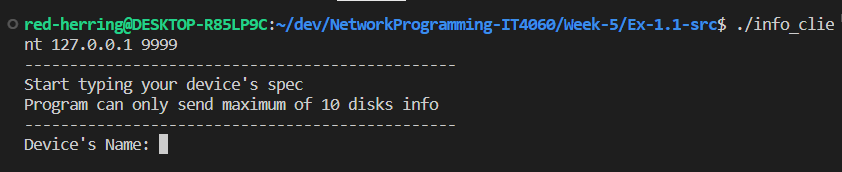
  <figcaption>info_client đợi người dùng nhập dữ liệu sau khi két nối thành công.</figcaption>
</figure>

<figure>
  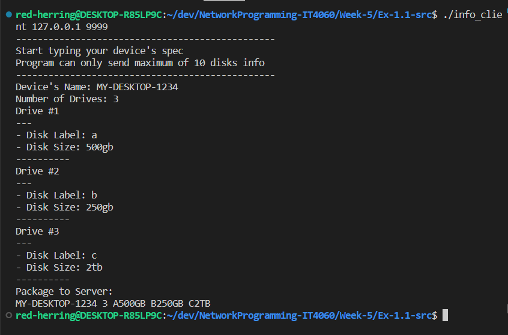
  <figcaption>Người dùng nhập dữ liệu. Có thể thấy tên ổ đĩa, đơn vị dung lượng được viết bằng chữ cái thường nhưng ở cuối chương trình có trường <b>Package to Server</b> cho thấy các kí tự đã được xử lý trước khi gửi.</figcaption>
</figure>

<figure>
  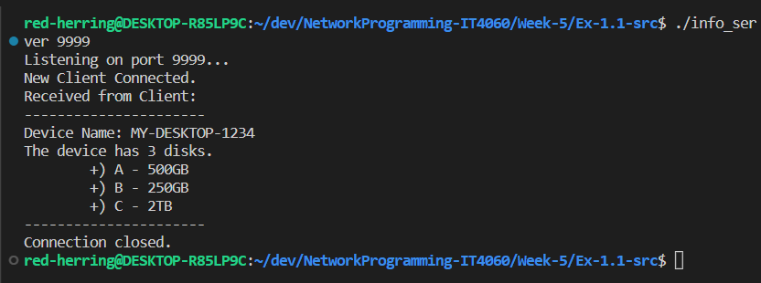
  <figcaption>Kết quả hiển thị bên info_server sau khi info_client đóng kết nối.</figcaption>
</figure>

### Bài tập 01.02

*client* sẽ thực hiện đọc file và gửi sang *server*. Bên phía *server* sẽ thực hiện đếm số lần chuổi xâu con xuất hiện trong dữ liệu được gửi đến.

Theo ví dụ để bài đã cho, cần phải lấy được chuỗi xâu con `0123456789` từ nội dung file sau:

> SOICTSOICT0123456789012345678901234567890123456789SOICTSOICTSOICT01234567890123456789012345678901234567890123456789012345678901234567890123456789SOICTSOICT

*server* sử dụng hàm `strstr()` trong vòng lặp để đếm số lần xâu con xuất hiện trong nội dung từ *client*. Lưu ý cần cập nhật vị trí bắt dầu cần xét tiếp theo sau mỗi vòng lặp để tránh tình trạng overlapping dẫn đến lặp vô hạn.

<figure>
  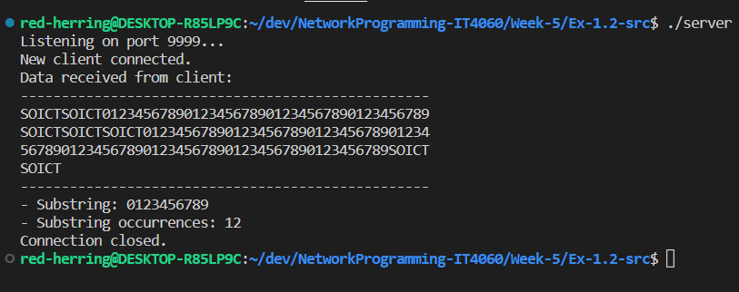
  <figcaption>Kết quả hiển thị bên server cho thấy số lần xuất hiện của xâu kí tự cho sẵn trong nội dung file gửi tới.</figcaption>
</figure>

### Bài tập 01.03

Chương trình *udp_receiver* sẽ được nhập tham số cổng chờ từ dòng lệnh, lắng nghe kết nối từ cổng được chỉ định để nhận dữ liệu. Nội dung nhận được sẽ được lưu vào file **receiver_datagram.txt**, đường dẫn tới file được hard-code ở trong chương trình. 

Chương trình *udp_sender* sẽ được nhập địa chỉ kết nối tới, tham số cổng cần kết nối tới và chỉ định file cần gửi đi qua dòng lệnh. 

<figure>
  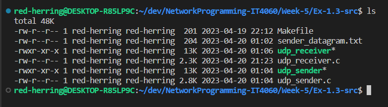
  <figcaption>Trước khi chạy chương trình, trong thư mục không có file <b>receiver_datagram.txt</b>.</figcaption>
</figure>

<figure>
  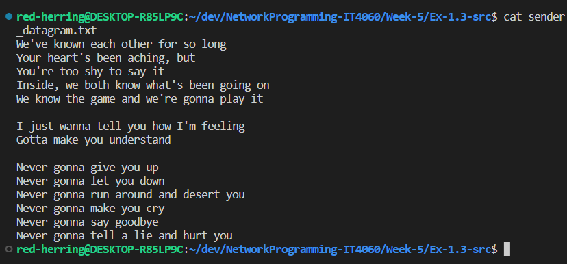
  <figcaption>Nội dung của file gửi: <b>sender_datagram.txt</b></figcaption>
</figure>

<figure>
  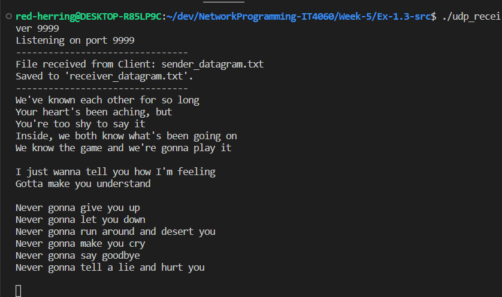
  <figcaption>Kết quả nhận được bên server, tên file và nội dung nhận được in ra màn hình rồi lưu vào file <b>receiver_datagram.txt</b>.</figcaption>
</figure>

<figure>
  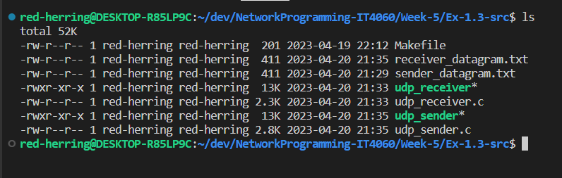
  <figcaption>Sau khi gửi thành công sẽ thấy trong thư mục xuất hiện file <b>receiver_datagram.txt</b>.</figcaption>
</figure>

<figure>
  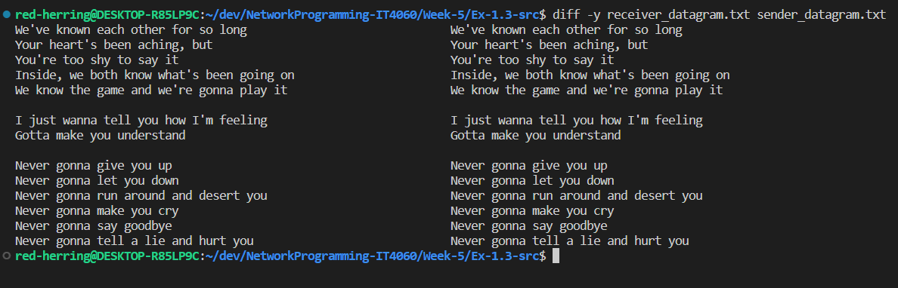
  <figcaption>So sánh nội dung hai file nhận và gửi bằng câu lệnh <b><i>diff</i></b>.</figcaption>
</figure>

### Bài tập 01.04

*udp_sender2* yêu cầu người dùng nhập địa chỉ IPv4 và cổng kết nối của server UDP cần gửi file đến kèm theo file muốn chuyển.

*udp_receiver2* sẽ được nhập cổng chờ từ tham số dòng lệnh và sẽ lắng nghe thông tin từ cổng chỉ định. *udp_receiver2* có thể nhận kết nối từ nhiều sender khác nhau, nội dung file sẽ phân biệt file từ sender nào bằng các tham số như địa chỉ IP và số hiệu cồng kết nối bên sender. 

Trong bài tập này để minh họa, các *udp_sender2* sẽ thực hiện gửi file `dummy.txt` liên tục tới *udp_receiver2*, bên phía receiver nhận được sẽ thêm vào file được định danh như sau:

> địa_chỉ_ip_sender:cổng_sender.log

Các bước thực hiện cho kết quả như sau: Khởi động 1 receiver và chạy số sender tùy ý (trong ví dụ này là 2 sender). Ta có kết quả như sau:

<figure>
  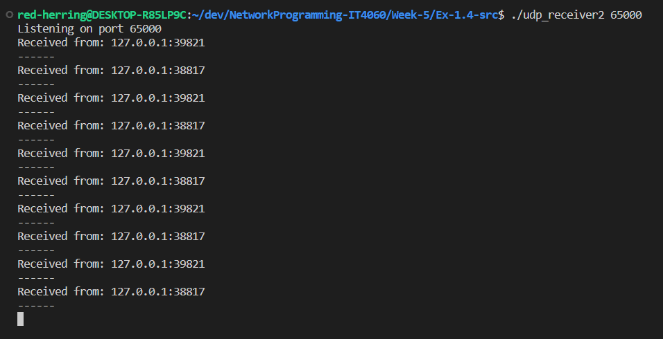
  <figcaption>Bên receiver đã đưa ra thông báo nhận được file từ 2 sender lần lượt là <b>127.0.0.1:39821</b> và <b>127.0.0.1:38817</b>.</figcaption>
</figure>

<figure>
  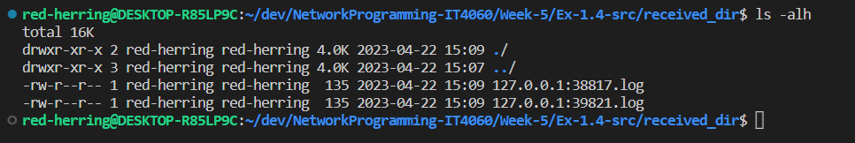
  <figcaption>Nội dung file được ghi vào các file log tương ứng với socket gửi của các sender.</figcaption>
</figure> 